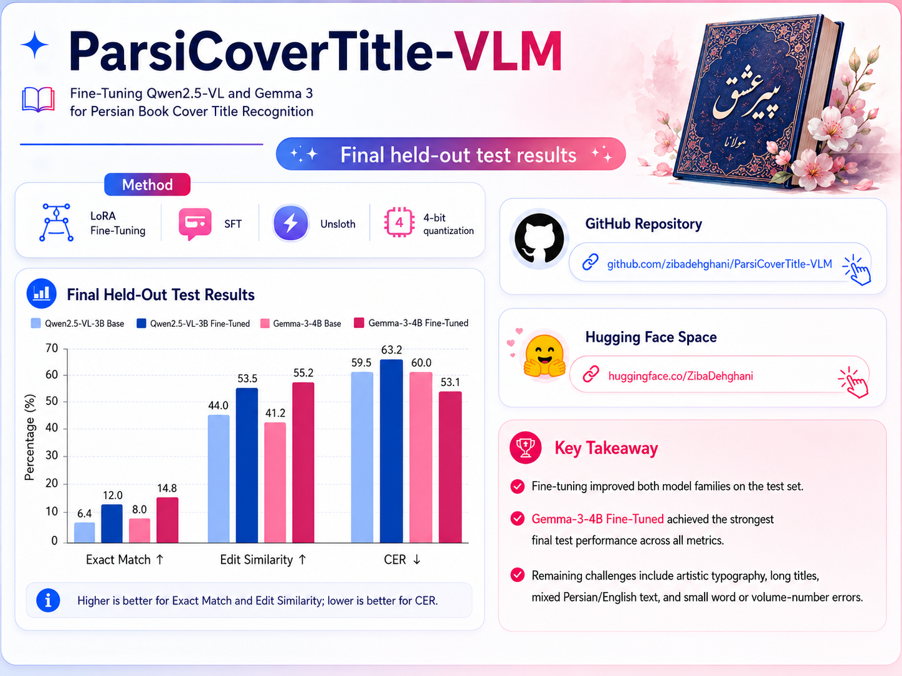
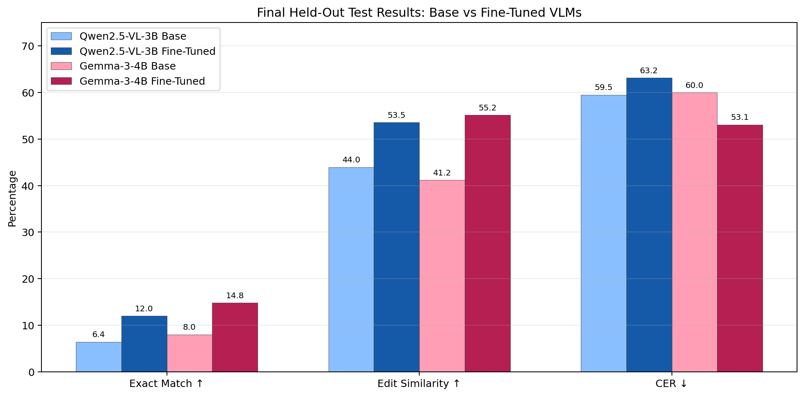

<p align="center">
  
</p>

<br>

# 🟦 ParsiCoverTitle-VLM

**Fine-Tuning Qwen2.5-VL and Gemma 3 for Persian Book Cover Title Recognition**

> Extract the main Persian book title from a cover image with Vision-Language Models (VLMs), LoRA adapters, and Supervised Fine-Tuning (SFT).

## Project Goal

The system receives a book-cover image and returns **only the main Persian title**. It is instructed to exclude author names, translator names, publishers, prices, edition numbers, and promotional text.

## Dataset and Splits

- **Dataset:** `shenasa/bookroom-persian-book-covers-and-titles`
- **Train:** 2,000 samples
- **Validation:** 250 samples
- **Held-out Test:** 250 samples

The test split remained untouched until final evaluation. Both model families used the same underlying train, validation, and test samples.

## Models

| Model family | Base model |
|---|---|
| Qwen | `Qwen2.5-VL-3B-Instruct` |
| Gemma | `Gemma-3-4B-IT` |

## Training Setup

- Supervised Fine-Tuning (SFT)
- LoRA adapters
- 4-bit quantization
- 2 epochs
- Learning rate: `2e-4`
- Effective batch size: `8`
- Maximum image side: `512`
- Deterministic decoding: `do_sample=False`
- Environment: Google Colab, NVIDIA L4, Unsloth, TRL

## Held-Out Test Results

| Model | Exact Match (%) ↑ | Edit Similarity (%) ↑ | CER (%) ↓ |
|---|---:|---:|---:|
| Qwen2.5-VL-3B Base | 6.4 | 43.96 | 59.51 |
| Qwen2.5-VL-3B Fine-Tuned | 12.0 | 53.54 | 63.17 |
| Gemma-3-4B Base | 8.0 | 41.15 | 60.00 |
| **Gemma-3-4B Fine-Tuned** | **14.8** | **55.16** | **53.09** |

**Selected model:** Gemma-3-4B Fine-Tuned. It achieved the highest Exact Match and Edit Similarity, plus the lowest Character Error Rate (CER).



## Metrics

- **Exact Match:** prediction exactly matches the reference title.
- **Edit Similarity:** character-level textual similarity between prediction and reference.
- **Character Error Rate (CER):** character-level transcription error; lower is better.

## Key Findings

- Fine-tuning improved Exact Match and Edit Similarity for both model families.
- Gemma-3-4B Fine-Tuned improved across all three metrics relative to its base version.
- Qwen2.5-VL-3B Fine-Tuned improved Exact Match and Edit Similarity, while its CER increased. This suggests longer or partly extra generated text may still introduce additional character-level errors.
- Remaining difficult cases include artistic typography, long titles, mixed Persian/English text, and small word or volume-number errors.

## Repository Structure

```text
.
├── ParsiCoverTitle_VLM_GitHub_Ready.ipynb
├── README.md
├── requirements.txt
└── assets/
    ├── final_test_metrics_compact_soft.png
    └── project_poster.png
```

## Reproduction

1. Open the notebook in Google Colab with a GPU runtime.
2. Install dependencies using the first code cell.
3. Mount Google Drive and set the `PROJECT_ROOT` path.
4. Run the notebook sections in order.

> Training and inference require a compatible CUDA GPU. The notebook stores checkpoints, final LoRA adapters, predictions, tables, and figures in Google Drive.

## Acknowledgements

- Dataset: `shenasa/bookroom-persian-book-covers-and-titles`
- Training stack: Unsloth, TRL, Hugging Face Transformers, Datasets, PEFT

## Author

**Ziba Dehghani**
